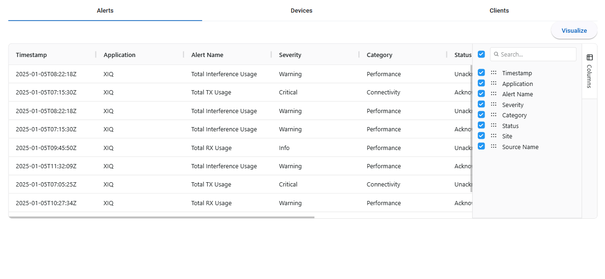
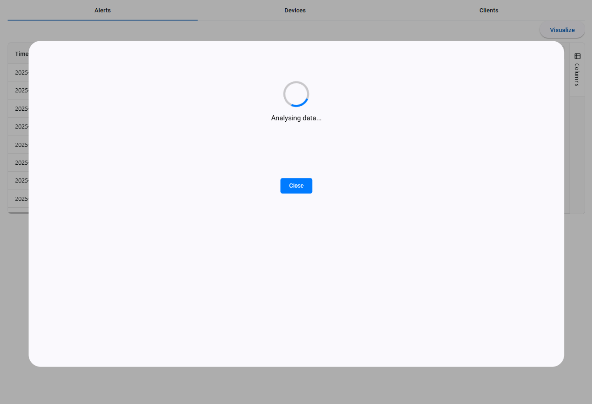
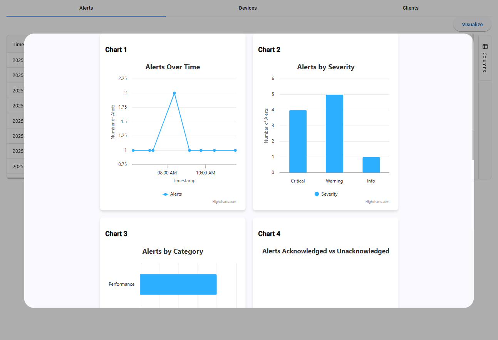
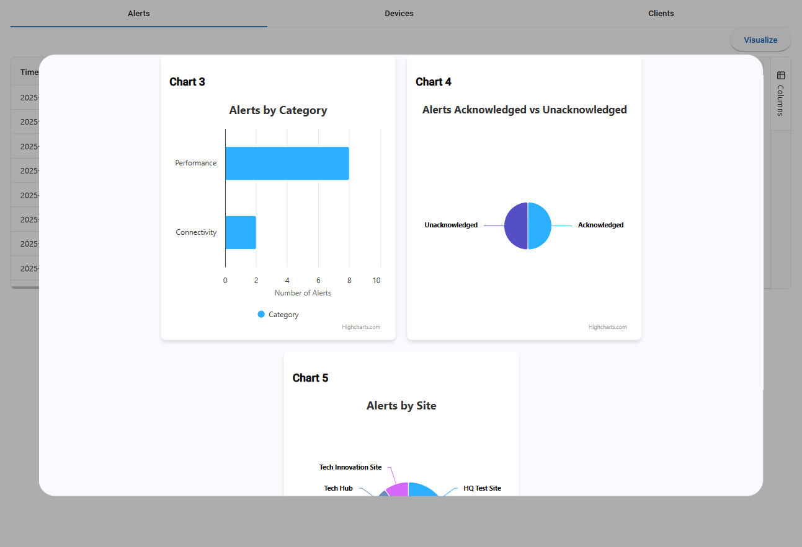
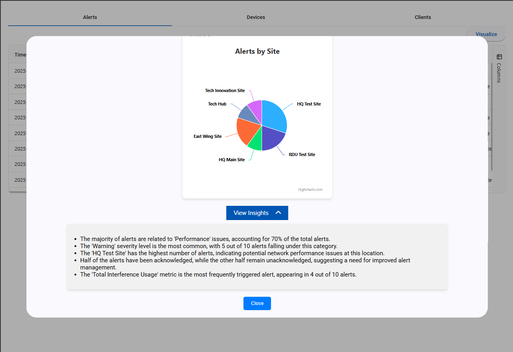

# AutoViz

AutoViz is an innovative visualization tool designed to simplify data representation and network analysis. By seamlessly converting complex table data into dynamic, interactive graphs and visualizations, AutoViz empowers users to uncover insights, monitor network performance, and make data-driven decisions with ease.

## 🚀 Features

- **Interactive Data Visualization**: Transform tabular data into dynamic charts and graphs
- **Network Device Monitoring**: Monitor and analyze network devices, clients, and alerts
- **AI-Powered Insights**: Leverage Azure AI for intelligent data analysis and recommendations
- **Real-time Data Processing**: Process and visualize data in real-time with responsive UI
- **Comprehensive Dashboard**: Multiple views for devices, clients, and alerts management

## 🛠️ Tech Stack

### Frontend
- **Angular 19** - Modern web framework for building dynamic user interfaces
- **Angular Material** - UI component library for consistent design
- **Highcharts Angular** - Advanced charting library for data visualization
- **AG Grid** - Feature-rich data grid component for displaying tabular data
- **TypeScript** - Type-safe JavaScript development
- **SCSS** - Enhanced CSS with variables and mixins

### Backend
- **Python Flask** - Lightweight web framework for API development
- **Azure AI Inference** - AI-powered data analysis and insights
- **Pandas** - Data manipulation and analysis library
- **Flask-CORS** - Cross-Origin Resource Sharing support

### Development Tools
- **Node.js & npm** - Package management and build tools
- **Angular CLI** - Command-line interface for Angular development

## 📱 Application Screenshots

### Main Dashboard


### Analytics view - Loading


### Analytics view - 1


### Analytics view - 2


### Analytics view - 3


## 🚀 Getting Started

### Prerequisites
- Node.js (v16 or higher)
- Python 3.8+
- npm or yarn package manager

### Frontend Setup

Navigate to the frontend directory and install dependencies:

```bash
cd Angular-FE/autoViz
npm install
ng serve --port 4200
```

The Angular application will be available at `http://localhost:4200`

### Backend Setup

Navigate to the backend directory and set up the Python environment:

```bash
cd Backend
pip install -r requirements.txt
python app.py
```

The Flask API will be available at `http://localhost:5000`

## 📊 API Endpoints

The backend provides REST API endpoints for:
- `/devices` - Network devices data and management
- `/clients` - Client information and statistics  
- `/alerts` - System alerts and notifications
- `/analyze` - endpoint for AI-powered analysis
